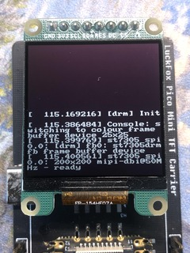
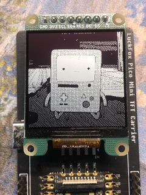
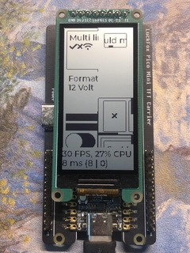
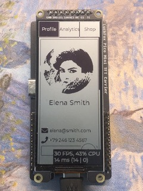
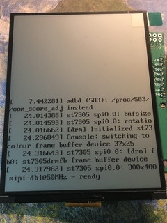
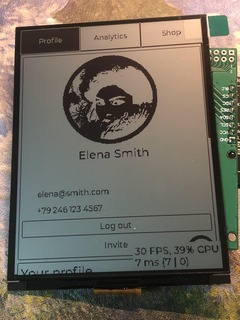

# 适用于 ST7305 反射式 TFT 的内核 DRM 驱动

[English](README.en.md)

| 硬件信息 |                                                                                                                                                                                                                            |
| -------- | -------------------------------------------------------------------------------------------------------------------------------------------------------------------------------------------------------------------------- |
| 开发板   | Luckfox Pico Mini                                                                                                                                                                                                          |
| 内核版本 | 5.10.160                                                                                                                                                                                                                   |
| 发行版   | Buildroot 2023.02.6                                                                                                                                                                                                        |
| 显示屏   | [YDP154H008-V3](https://yuyinglcd.com/products/1/17/500) 1.54" Mono 200x200                                                                                                                                                |
| -        | [YDP213H001-V3](https://yuyinglcd.com/products/1/17/260) 2.13" Mono 122x250                                                                                                                                                |
| -        | [YDP290H001-V3](https://yuyinglcd.com/products/1/17/261) 2.90" Mono 168x384                                                                                                                                                |
| -        | [W290HC019MONO-12Z](https://item.taobao.com/item.htm?id=871831722804&mi_id=0000vBUbFkosMzENLINW0DNEpDu1mdlByTlb9U8Knb0Kg2E&skuId=5706172761739&spm=tbpc.boughtlist.suborder_itemtitle.1.16b02e8dATbioT) 2.90" Mono 168x384 |
| -        | [W420HC018MONO-12Z](https://item.taobao.com/item.htm?id=871831722804&mi_id=0000vBUbFkosMzENLINW0DNEpJD3qW3wnoilcGBA0fK5Eus&skuId=5724504589973&spm=tbpc.boughtlist.suborder_itemtitle.1.6f4d2e8dbWO3RS) 4.20" Mono 300x400 |
| 驱动IC   | ST7305                                                                                                                                                                                                                     |
| -        | -                                                                                                                                                                                                                          |
| 显示屏   | [YDP420H001-V3](https://yuyinglcd.com/products/1/17/262) 4.20" Mono 300x400                                                                                                                                                |
| 驱动IC   | ST7306                                                                                                                                                                                                                     |




https://github.com/user-attachments/assets/9526318e-5c00-406e-a91f-2dd308e9b231

## FIXME: 仍然存在的问题

- [ ] YDP154H008-V3 需要加载两次驱动屏幕才能显示内容（加载、卸载、加载）
- [ ] YDP213H001-V3 屏幕在驱动加载几秒钟后冻结

## TODOs: 待办事项

- [ ] 支持 TE 引脚，防止画面撕裂
- [ ] 支持旋转

## 快速上手

以下步骤假设您使用的是 YDP290H001-V3 显示屏。

| 屏幕引脚定义 | Luckfox Pico 的引脚     |
| ------------ | ----------------------- |
| GND          | GND                     |
| VCC          | 3.3V                    |
| SCL          | SPI0_CLK_M0 - GPIO1_C1  |
| SDA          | SPI0_MOSI_M1 - GPIO1_C2 |
| RES          | GPIO1_C3                |
| DC           | GPIO1_C4                |
| CS           | SPI0_CS0_M0 - GPIO1_C0  |
| (TE)         | GPIO1_C5                |

### 1. 部署 Luckfox Pico SDK

强烈建议您在继续操作之前查看 [SDK 编译指南](https://wiki.luckfox.com/zh/Luckfox-Pico-Plus-Mini/SDK-Image-Compilation)。

```bash
mkdir -p ~/luckfox && cd ~/luckfox
git clone https://gitee.com/LuckfoxTECH/luckfox-pico.git pico
cd pico
```

根据 luckfox pico wiki 的说明，您需要安装以下软件包：

```bash
sudo apt-get install -y git ssh make gcc gcc-multilib g++-multilib module-assistant expect g++ gawk texinfo libssl-dev bison flex fakeroot cmake unzip gperf autoconf device-tree-compiler libncurses5-dev pkg-config bc python-is-python3 passwd openssl openssh-server openssh-client vim file cpio rsync curl
```

然后按照以下步骤配置 SDK：

```bash
❯ ./build.sh lunch
You're building on Linux
  Lunch menu...pick the Luckfox Pico hardware version:
  选择 Luckfox Pico 硬件版本:
                [0] RV1103_Luckfox_Pico
                [1] RV1103_Luckfox_Pico_Mini
                [2] RV1103_Luckfox_Pico_Plus
                [3] RV1103_Luckfox_Pico_WebBee
                [4] RV1106_Luckfox_Pico_Pro_Max
                [5] RV1106_Luckfox_Pico_Ultra
                [6] RV1106_Luckfox_Pico_Ultra_W
                [7] RV1106_Luckfox_Pico_Pi
                [8] RV1106_Luckfox_Pico_Pi_W
                [9] RV1106_Luckfox_Pico_86Panel
                [10] RV1106_Luckfox_Pico_86Panel_W
                [11] RV1106_Luckfox_Pico_Zero
                [12] custom
Which would you like? [0~12][default:0]: 1
  Lunch menu...pick the boot medium:
  选择启动媒介:
                [0] SD_CARD
                [1] SPI_NAND
Which would you like? [0~1][default:0]: 0
  Lunch menu...pick the system version:
  选择系统版本:
                [0] Buildroot
Which would you like? [0][default:0]: 0
[build.sh:info] Lunching for Default BoardConfig_IPC/BoardConfig-SD_CARD-Buildroot-RV1103_Luckfox_Pico_Mini-IPC.mk boards...
[build.sh:info] switching to board: /home/developer/luckfox/pico/project/cfg/BoardConfig_IPC/BoardConfig-SD_CARD-Buildroot-RV1103_Luckfox_Pico_Mini-IPC.mk
[build.sh:info] Running build_select_board succeeded.
```

至少编译一次内核和驱动程序：

```bash
./build.sh kernel
./build.sh driver
```

### 2. 替换内核 DTS

请先克隆此仓库

```bash
cd ~/luckfox
git clone https://github.com/IotaHydrae/st7305-kernel-drivers.git
cd st7305-kernel-drivers
```

如果您使用的是其他显示器，请先修改 dts 文件（`rv1103g-luckfox-pico-mini.dts`）中的兼容字符串。

```c
	tft: st7305@0 {
		...

		// compatible = "osptek,ydp154h008-v3";
		// compatible = "osptek,ydp213h001-v3";
		compatible = "osptek,ydp290h001-v3";
		// compatible = "osptek,ydp420h001-v3";

		...
	};
```

另外，如果您需要帧缓冲区控制台功能，则需要确保保留此 DTS 节点：

```c
chosen {
		bootargs = "earlycon=uart8250,mmio32,0xff4c0000 console=tty0 console=ttyFIQ0 root=/dev/mmcblk1p7 rootwait snd_soc_core.prealloc_buffer_size_kbytes=16 coherent_pool=0";
	};
```

将 dts 文件复制到 Luckfox Pico SDK

```bash
cp rv1103g-luckfox-pico-mini.dts ~/luckfox/pico/sysdrv/source/kernel/arch/arm/boot/dts/rv1103g-luckfox-pico-mini.dts
```

### 3. 构建并刷写新的内核镜像到 Luckfox Pico

返回 Luckfox Pico SDK 并构建新的内核镜像

```bash
cd ~/luckfox/pico
./build.sh kernel
```

运行以下命令重新刷写新的内核镜像文件 `output/image/boot.img`：

```bash
adb push output/image/boot.img /tmp
adb shell 'dd if=/tmp/boot.img of=/dev/mmcblk1p4 bs=1M'
adb reboot
```

### 4. 构建并测试 st7305 驱动程序

```bash
cd ~/luckfox/st7305-kernel-drivers
make && adb push st7305_tinydrm.ko /tmp
adb shell 'insmod /tmp/st7305_tinydrm.ko'
```

#### 4.1 驱动运行时可调整的参数

---

##### **dither_type**

参考 [dither.h](./dither.h) 头文件中的取值，这是一个示例，未来可能支持更多抖动算法

```c
enum {
	DITHER_TYPE_NONE,
	DITHER_TYPE_BAYER_4X4,
	DITHER_TYPE_BAYER_16X16,
	DITHER_TYPE_MAX,
};
```

```bash
echo 2 > /sys/class/spi_master/spi0/spi0.0/config/dither_type
```

---

#### 4.2 （待办事项）运行 lvgl 演示

## 参考

1. [kernel 5.10.160 source](https://elixir.bootlin.com/linux/v5.10.160/source)
2. [Luckfox Pico Wiki - Pinout](https://wiki.luckfox.com/zh/Luckfox-Pico-Plus-Mini/Pinout)
3. [ST7305 datasheet](https://admin.osptek.com/uploads/ST_7305_V0_2_d0b99d9cdb.pdf)
4. [DuRuofu's st7305 drivers for esp32](https://github.com/DuRuofu/esp-idf-st7305-Ink-screen)

## 使用到的转接板

- [适用于鱼鹰光电等 ST7305 反射式 TFT 的转接板](https://oshwhub.com/embeddedboys/shi-yong-yu-st7305-fan-she-shi-tft-de-zhuan-jie-ban)
- [Luckfox Pico Mini 2.9寸反射式TFT测试板](https://oshwhub.com/embeddedboys/luckfox-pico-mini-2-9-cun-fan-she-shi-tft-ce-shi-ban)
- [树莓派 TFT 接口 HAT](https://oshwhub.com/embeddedboys/shu-mei-pai-tft-jie-kou-hat)
