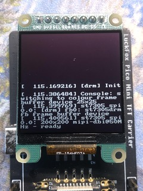
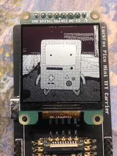
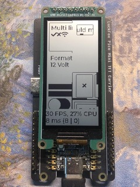
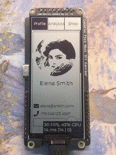
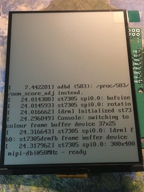
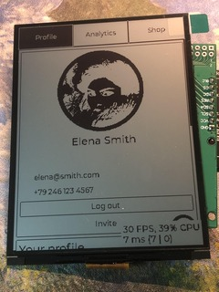

# 适用于 ST7305 反射式 TFT 的内核 DRM 驱动

[English](README.en.md)

| 硬件信息 |                                                                                                                                                                                                                            |
|----------|----------------------------------------------------------------------------------------------------------------------------------------------------------------------------------------------------------------------------|
| 开发板   | Luckfox Lyra                                                                                                                                                                                                               |
| 内核版本 | 6.1.99                                                                                                                                                                                                                     |
| 发行版   | Buildroot 2024.02                                                                                                                                                                                                          |
| 显示屏   | [YDP154H008-V3](https://yuyinglcd.com/products/1/17/500) 1.54" Mono 200x200                                                                                                                                                |
| -        | [YDP213H001-V3](https://yuyinglcd.com/products/1/17/260) 2.13" Mono 122x250                                                                                                                                                |
| -        | [YDP290H001-V3](https://yuyinglcd.com/products/1/17/261) 2.90" Mono 168x384                                                                                                                                                |
| -        | [W290HC019MONO-12Z](https://item.taobao.com/item.htm?id=871831722804&mi_id=0000vBUbFkosMzENLINW0DNEpDu1mdlByTlb9U8Knb0Kg2E&skuId=5706172761739&spm=tbpc.boughtlist.suborder_itemtitle.1.16b02e8dATbioT) 2.90" Mono 168x384 |
| -        | [W420HC018MONO-12Z](https://item.taobao.com/item.htm?id=871831722804&mi_id=0000vBUbFkosMzENLINW0DNEpJD3qW3wnoilcGBA0fK5Eus&skuId=5724504589973&spm=tbpc.boughtlist.suborder_itemtitle.1.6f4d2e8dbWO3RS) 4.20" Mono 300x400 |
| 驱动IC   | ST7305                                                                                                                                                                                                                     |
| -        | -                                                                                                                                                                                                                          |
| 显示屏   | [YDP420H001-V3](https://yuyinglcd.com/products/1/17/262) 4.20" Mono 300x400                                                                                                                                                |
| 驱动IC   | ST7306                                                                                                                                                                                                                     |




https://github.com/user-attachments/assets/9526318e-5c00-406e-a91f-2dd308e9b231

## FIXME: 仍然存在的问题

- [ ] YDP154H008-V3 需要加载两次驱动屏幕才能显示内容（加载、卸载、加载）
- [ ] YDP213H001-V3 屏幕在驱动加载几秒钟后冻结

## TODOs: 待办事项

- [x] 支持 TE 引脚，防止画面撕裂
- [ ] 支持旋转

## 快速上手

以下步骤假设您使用的是 YDP290H001-V3 显示屏。

| Display | Luckfox Lyra Pins | RMIO    | Function  | DTS                            |
|---------|-------------------|---------|-----------|--------------------------------|
| GND     | GND               | -       | -         | -                              |
| VCC     | 3.3V              | -       | -         | -                              |
| SCL     | GPIO1_D1          | RMIO_29 | SPI0_CLK  | rm_io29_spi0_clk               |
| SDA     | GPIO1_C3          | RMIO_28 | SPI0_MOSI | rm_io28_spi0_mosi              |
| RES     | GPIO0_A2          | RMIO_2  | GPIO      | &gpio0 RK_PA2 GPIO_ACTIVE_HIGH |
| DC      | GPIO0_A3          | RMIO_3  | GPIO      | &gpio0 RK_PA3 GPIO_ACTIVE_HIGH |
| CS      | GPIO0_A4          | RMIO_4  | SPI0_CS0  | rm_io4_spi0_csn0               |
| (TE)    | GPIO0_A5          | RMIO_5  | GPIO      | &gpio0 RK_PA5 GPIO_ACTIVE_HIGH |

### 1. 部署 Luckfox Lyra SDK

至少编译一次内核和驱动程序：

```bash
./build.sh kernel
./build.sh driver
```

### 2. 替换内核 DTS

请先克隆此仓库

```bash
cd ~/luckfox
git clone https://github.com/IotaHydrae/st7305-kernel-drivers.git -b luckfox-lyra --depth 1
cd st7305-kernel-drivers
```

如果您使用的是其他显示器，请先修改 dts 文件 (`rk3506g-luckfox-lyra-sd.dts`) 中的兼容字符串。

```c
	tft: st7305@0 {
		...

		// compatible = "osptek,ydp154h008-v3";
		// compatible = "osptek,ydp213h001-v3";
		compatible = "osptek,ydp290h001-v3";
		// compatible = "osptek,ydp420h001-v3";

		...
	};
```

将 dts 文件复制到 Luckfox Lyra SDK

```bash
cp rk3506g-luckfox-lyra-sd.dts ~/luckfox/lyra/kernel-6.1/arch/arm/boot/dts/rk3506g-luckfox-lyra-sd.dts
```

### 3. 构建并刷写新的内核镜像到 Luckfox Lyra

返回 Luckfox Lyra SDK 并构建新的内核镜像

```bash
cd ~/luckfox/lyra
./build.sh kernel
```

运行以下命令重新刷写新的内核镜像 `kernel-6.1/zboot.img`：

```bash
adb push kernel-6.1/zboot.img /tmp
adb shell 'dd if=/tmp/zboot.img of=/dev/mmcblk0p2 bs=1M'
adb reboot
```

### 4. 构建并测试 st7305 驱动程序

```bash
cd ~/luckfox/st7305-kernel-drivers
make && adb push st7305_tinydrm.ko /tmp
adb shell 'insmod /tmp/st7305_tinydrm.ko'
```

#### 4.1 驱动运行时可调整的参数

---

##### **dither_type**

参考 [dither.h](./dither.h) 头文件中的取值，这是一个示例，未来可能支持更多抖动算法

```c
enum {
	DITHER_TYPE_NONE,
	DITHER_TYPE_BAYER_4X4,
	DITHER_TYPE_BAYER_16X16,
	DITHER_TYPE_MAX,
};
```

```bash
echo 2 > /sys/class/spi_master/spi0/spi0.0/config/dither_type
```

---

#### 4.2 运行 lvgl 演示

```bash
git clone https://github.com/lvgl/lv_port_linux.git && cd lv_port_linux
git submodule update --init
```

disable `evdev` feature of lvgl (requires `libevdev`)
```diff
diff --git a/lv_conf.defaults b/lv_conf.defaults
index e4a749e..21c139c 100644
--- a/lv_conf.defaults
+++ b/lv_conf.defaults
@@ -55,7 +55,7 @@ LV_WAYLAND_USE_DMABUF           0
 LV_USE_GLFW 0

 # Input support (enable when using FBDEV or DRM)
-LV_USE_EVDEV    1
+LV_USE_EVDEV    0
 LV_USE_LIBINPUT 0

 # Auxiliary drivers
```

modify the `src/lib/display_backends/fbdev.c` file according to the fllowing:

```diff
diff --git a/src/lib/display_backends/fbdev.c b/src/lib/display_backends/fbdev.c
index f330fd8..36dd1c1 100644
--- a/src/lib/display_backends/fbdev.c
+++ b/src/lib/display_backends/fbdev.c
@@ -92,6 +92,9 @@ static lv_display_t * init_fbdev(void)
         return NULL;
     }

+    lv_theme_t *theme = lv_theme_mono_init(disp, 0, &lv_font_montserrat_12);
+    lv_display_set_theme(disp, theme);
+
     lv_linux_fbdev_set_file(disp, device);

     return disp;
```

then build the lvgl demo
```bash
export CC=${HOME}/luckfox/lyra/prebuilts/gcc/linux-x86/arm/gcc-arm-10.3-2021.07-x86_64-arm-none-linux-gnueabihf/bin/arm-none-linux-gnueabihf-gcc
export CXX=${HOME}/luckfox/lyra/prebuilts/gcc/linux-x86/arm/gcc-arm-10.3-2021.07-x86_64-arm-none-linux-gnueabihf/bin/arm-none-linux-gnueabihf-g++

mkdir -p build && cd build
cmake .. -G Ninja

ninja && adb push bin/lvglsim /tmp
```

Go to the device (e.g. via `adb shell`) and run the following command

```bash
cd /tmp
./lvglsim
```

## Some useful tricks for debugging

Automatically mount debugfs on startup
```bash
vi /etc/fstab
# append the following line to the end of the file
debugfs         /sys/kernel/debug       debugfs defaults        0       0
```

cat gpio debugfs to see the current state of the gpio pins
```bash
cat /sys/kernel/debug/gpio
```

View Interruption Information
```bash
cat /proc/interrupts | grep te
# 61:      68330  rockchip_gpio_irq  21 Edge      st7305-te
cat /sys/kernel/irq/61/per_cpu_count
```

## 参考

1. [kernel 6.1.99 source](https://elixir.bootlin.com/linux/v6.1.99/source)
2. [Luckfox Lyra Wiki - Pinout](https://wiki.luckfox.com/zh/Luckfox-Lyra/Pinout)
3. [ST7305 datasheet](https://admin.osptek.com/uploads/ST_7305_V0_2_d0b99d9cdb.pdf)
4. [DuRuofu's st7305 drivers for esp32](https://github.com/DuRuofu/esp-idf-st7305-Ink-screen)

## 使用到的转接板

- [适用于鱼鹰光电等 ST7305 反射式 TFT 的转接板](https://oshwhub.com/embeddedboys/shi-yong-yu-st7305-fan-she-shi-tft-de-zhuan-jie-ban)
- [Luckfox Pico Mini 2.9寸反射式TFT测试板](https://oshwhub.com/embeddedboys/luckfox-pico-mini-2-9-cun-fan-she-shi-tft-ce-shi-ban)
- [树莓派 TFT 接口 HAT](https://oshwhub.com/embeddedboys/shu-mei-pai-tft-jie-kou-hat)
